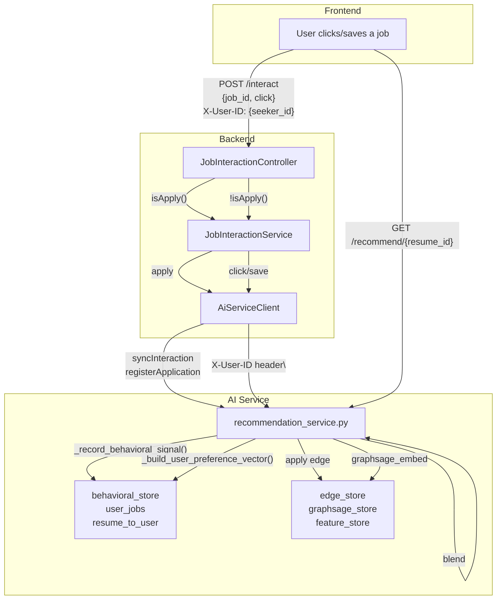

# GraphSAGE Job Recommendation System — Redesign Plan

## Problem Statement

The current system uses **soft attribution** for click/save events:

- Click/save are **user-level implicit behaviors** — they do not reliably belong to a specific resume.
- Soft attribution (NLP similarity guessing) pollutes graph structure and causes GraphSAGE embedding drift.
- GraphSAGE embeddings should only be trained on **ground truth** apply events.

## New Design Principles

1. **Only `apply` events create graph edges** → GraphSAGE embeddings are trained on these.
2. **Click/save events do NOT create graph edges** → stored at **user level** as behavioral signals.
3. Behavioral signals feed into the **user-level preference-vector logic only**.
4. Recommendations are generated at the **resume level** by blending the per-resume GraphSAGE embedding with the user's behavioral preference vector.

---

## Storage Design: User-Level Behavioral Store

Key insight: a user may have multiple resumes, but click/save actions are **user behaviors** — they reflect general interest, not resume-specific intent.

- `behavioral_store` is keyed by `user_id` (jobSeekerId), **not** `resume_id`.
- All resumes of the same user share the same behavioral profile.
- The `jobSeekerId` is sourced from the authenticated backend principal, passed via `X-User-ID` HTTP header to the AI service. No DTO changes needed.

```python
# New in-memory stores in recommendation_service.py
behavioral_store: Dict[str, List[dict]]  # user_id → [{job_id, action_type, weight, timestamp}, ...]
user_jobs: Dict[str, List[str]]          # user_id → [job_ids] (reverse index for fast lookup)
```

---

## Current Data Flow

```
Frontend
  │
  ├─ apply    → JobInteractionController → logWithSingleResume
  │                         │
  │                         ├─ Save JobInteraction(row per user+job)
  │                         └─ aiServiceClient.syncInteraction(resumeId, jobId)
  │                                    │
  │                                    ├─ create graph edge (resume→job)
  │                                    └─ run local GraphSAGE → update graphsage_store
  │
  └─ click/save → JobInteractionController → logWithMultipleResumes
                           │
                           ├─ Save JobInteraction(row per user+job)
                           └─ resolveResumes() → all resumes of user
                                     │
                                     └─ aiServiceClient.syncInteractionWithMultipleResumes(jobId, resumeIds[])
                                               │
                                               ├─ soft attribution (NLP similarity) ← REMOVED
                                               ├─ create MULTIPLE edges (weighted per resume) ← REMOVED
                                               └─ run local GraphSAGE for each attributed resume ← REMOVED
```

---

## New Data Flow

```
Frontend
  │
  ├─ apply    → JobInteractionController → logWithSingleResume
  │                         │
  │                         ├─ Save JobInteraction
  │                         └─ aiServiceClient.syncInteraction(resumeId, jobId)
  │                                    │
  │                                    ├─ create graph edge (resume→job)
  │                                    └─ run local GraphSAGE → update graphsage_store
  │
  └─ click/save → JobInteractionController → logWithMultipleResumes
                           │
                           ├─ Save JobInteraction
                           └─ aiServiceClient.recordBehavioralSignal(jobSeekerId, jobId, eventType)
                                     │
                                     └─ recommendation_service: _record_behavioral_signal()
                                               │
                                               ├─ behavioral_store[user_id].append({job_id, ...})
                                               └─ user_jobs[user_id].append(job_id)
                                                          (NO edge, NO GraphSAGE run)

Recommendation query (per resume):
  user_pref_vec = build_user_preference_vector(user_id)   # from behavioral_store
  resume_gs_vec = graphsage_store[resume_id]              # from apply edges only
  query_vec = alpha * resume_gs_vec + (1-alpha) * user_pref_vec
```

---

## Changes by File

### 1. AI Service — `recommendation_service.py`

#### New in-memory stores

```python
# User-level behavioral signals: user_id → [{job_id, action_type, weight, timestamp}, ...]
behavioral_store: Dict[str, List[dict]] = {}

# Reverse index: user_id → [job_ids] for fast lookup
user_jobs: Dict[str, List[str]] = {}

# Map resume to user: resume_id → user_id (populated when resume nodes are added)
resume_to_user: Dict[str, str] = {}
```

#### New helper: `_record_behavioral_signal()`

```python
def _record_behavioral_signal(user_id: str, job_id: str, action_type: str) -> None:
    """Record click/save as user-level behavioral signal. No graph edge. No GraphSAGE."""
    if job_id not in job_catalog:
        raise ValueError(f"Job not found: {job_id}")

    weight = ACTION_WEIGHTS.get(action_type, 0.1)
    timestamp = datetime.utcnow().isoformat()

    # Append to user's behavioral history
    entry = {
        "job_id": job_id,
        "action_type": action_type,
        "weight": weight,
        "timestamp": timestamp
    }
    behavioral_store.setdefault(user_id, []).append(entry)

    # Update reverse index
    if job_id not in user_jobs.setdefault(user_id, []):
        user_jobs.setdefault(user_id, []).append(job_id)

    _persist_behavioral_signal(user_id, entry)
```

#### New: `_build_user_preference_vector()`

```python
def _build_user_preference_vector(user_id: str) -> torch.Tensor:
    """Build recency-weighted preference vector from user's behavioral signals."""
    jobs = user_jobs.get(user_id, [])
    if not jobs:
        return torch.zeros(EMBEDDING_DIM)

    interactions = behavioral_store.get(user_id, [])
    interactions.sort(key=lambda x: x["timestamp"], reverse=True)
    interactions = interactions[:10]  # cap at 10 most recent

    half_life = 30 * 24 * 3600  # 30 days in seconds
    now = time.time()
    preference_vec = None

    for interaction in interactions:
        job_id = interaction["job_id"]
        if job_id not in feature_store:
            continue

        job_embed = feature_store[job_id]
        age = now - datetime.fromisoformat(interaction["timestamp"]).timestamp()
        recency_weight = math.exp(-age / half_life)
        score = recency_weight * interaction["weight"]

        if preference_vec is None:
            preference_vec = score * job_embed.clone()
        else:
            preference_vec += score * job_embed

    if preference_vec is None:
        return torch.zeros(EMBEDDING_DIM)

    return torch.nn.functional.normalize(preference_vec, p=2, dim=0)
```

#### Updated: `get_recommendations()`

Replace the preference vector source (currently `edge_store`) with `_build_user_preference_vector(user_id)`. The resume node must store its `user_id` to resolve the user at recommendation time.

```python
def get_recommendations(resume_id: str, top_k: int = 5, excluded_job_ids: Optional[List[str]] = None):
    # GraphSAGE embedding (per-resume, trained on apply edges only)
    graphsage_embed = graphsage_store.get(resume_id)

    # Resolve user from resume
    user_id = resume_to_user.get(resume_id)
    if not user_id:
        user_pref_vec = torch.zeros(EMBEDDING_DIM)
    else:
        user_pref_vec = _build_user_preference_vector(user_id)

    # Blend: structural + behavioral
    num_interactions = len(behavioral_store.get(user_id, [])) if user_id else 0
    alpha = max(0.3, 1.0 - 0.07 * num_interactions)  # decay toward 0.3 as interactions grow
    query_vec = alpha * graphsage_embed + (1 - alpha) * user_pref_vec
    query_vec = torch.nn.functional.normalize(query_vec, p=2, dim=0)

    # Score all jobs via cosine similarity...
```

#### Updated: `add_resume_node()` — store `user_id`

The `POST /api/v1/add_node` request body must include `user_id` for resume nodes:

```json
{
    "node_id": "uuid",
    "text": "resume text...",
    "node_type": "resume",
    "user_id": "job_seeker_uuid"
}
```

```python
def _add_resume_node(node_id: str, text: str, user_id: str):
    # ... existing embedding logic ...
    raw_node_store[node_id] = {
        "node_type": "resume",
        "text_snippet": text[:200],
        "encoded": True,
        "user_id": user_id      # NEW
    }
    resume_to_user[node_id] = user_id
```

#### Unchanged: `process_application()`

The apply path stays exactly the same — it correctly creates a graph edge and runs local GraphSAGE.

---

### 2. AI Service — `recommendations.py` (API route)

#### `POST /api/v1/interact` — split by event type

The AI service reads `jobSeekerId` from the **`X-User-ID`** HTTP header injected by the backend. No change to the request body is needed for click/save.

```python
from fastapi import Request

@router.post("/interact")
async def handle_interaction(req: Request):
    body = await req.json()
    action_type = body.get("action_type")
    job_id = body.get("job_id")

    if job_id not in job_catalog:
        return error_response("Job not found", 404)

    if action_type == "apply":
        return _handle_apply(body)  # existing logic unchanged

    elif action_type in ("click", "save"):
        job_seeker_id = req.headers.get("x-user-id")
        if not job_seeker_id:
            return error_response("X-User-ID header required for click/save", 400)

        _record_behavioral_signal(job_seeker_id, job_id, action_type)

        return success_response({
            "job_id": job_id,
            "action_type": action_type,
            "user_id": job_seeker_id,
            "message": "Behavioral signal recorded."
        })

    else:
        return error_response(f"Unknown action_type: {action_type}", 400)
```

**Backend sends to AI service for click/save:**

```
POST /api/v1/interact
Header: X-User-ID: {job_seeker_id}
Body: {"job_id": "job_uuid", "action_type": "click"}
```

`resume_ids` is removed from the click/save path entirely.

---

### 3. AI Service — `graph.py` (visualization)

`GET /api/v1/graph/snapshot` and `/snapshot/{node_id}`: the graph now contains **only apply edges** (click/save no longer create edges). The HTML dashboard should only render apply edges.

---

### 4. Backend — `JobInteractionService.java`

Refactor `logWithMultipleResumes()` — remove `resumeIds` from the AI call, use `jobSeekerId` instead:

```java
@Transactional
public void logWithMultipleResumes(
        UUID jobSeekerId,
        UUID jobId,
        InteractionEventType eventType,
        List<UUID> resumeIds,
        Map<String, Object> metadata
) {
    if (!jobRepository.existsById(jobId)) {
        throw new ResourceNotFoundException("Job not found: " + jobId);
    }

    // Debounce: skip duplicate click within 5-minute window
    if (eventType == InteractionEventType.click) {
        Instant cutoff = Instant.now().minus(CLICK_DEBOUNCE);
        if (interactionRepository.existsByJobSeekerIdAndJobIdAndEventTypeAndCreatedAtAfter(
                jobSeekerId, jobId, InteractionEventType.click, cutoff)) {
            log.debug("Skipping duplicate click interaction for seeker={} job={}", jobSeekerId, jobId);
            return;
        }
    }

    // Save interaction record (one row per user+job, not per resume)
    JobInteraction interaction = JobInteraction.builder()
            .jobSeekerId(jobSeekerId)
            .jobId(jobId)
            .eventType(eventType)
            .metadata(metadata)
            .build();

    interactionRepository.save(interaction);
    log.info("[Interaction] seeker={} job={} event={}", jobSeekerId, jobId, eventType.name());

    // Route to AI service by event type
    if (eventType.isGraphEdge()) {
        // Apply: sync as graph edge (defensive — apply normally goes through logWithSingleResume)
        if (resumeIds != null && !resumeIds.isEmpty()) {
            for (UUID resumeId : resumeIds) {
                aiServiceClient.syncInteraction(resumeId, jobId, eventType.name());
            }
        }
    } else {
        // Click/save: record as user-level behavioral signal (no resume IDs needed)
        aiServiceClient.recordBehavioralSignal(jobSeekerId, jobId, eventType);
    }
}
```

Remove the old soft attribution Javadoc from `logWithMultipleResumes()`. Keep `logWithSingleResume()` unchanged.

---

### 5. Backend — `JobInteractionController.java`

No structural changes needed — the routing logic already uses `seeker.getId()` which is the `jobSeekerId`. Update the Javadoc to reflect the new behavior:

```java
/**
 * For APPLY events:
 * Uses explicit resume_id, creates a graph edge, updates GraphSAGE embedding.
 *
 * For CLICK/SAVE events:
 * Records interaction at user level as behavioral signal.
 * No graph edge is created. Signals feed into the preference vector only.
 */
```

---

### 6. Backend — `AiServiceClient.java`

Add new async method for user-level behavioral signals. The `jobSeekerId` is passed via HTTP header `X-User-ID` (set by the authenticated backend, not the frontend).

```java
@Async
public void recordBehavioralSignal(UUID jobSeekerId, UUID jobId, InteractionEventType eventType) {
    String url = aiBaseUrl + "/api/v1/interact";
    HttpHeaders hdrs = new HttpHeaders();
    hdrs.set("X-User-ID", jobSeekerId.toString());
    Map<String, Object> body = Map.of(
        "job_id", jobId.toString(),
        "action_type", eventType.name()
    );
    HttpEntity<Map<String, Object>> entity = new HttpEntity<>(body, hdrs);
    try {
        restTemplate.postForEntity(url, entity, Void.class);
    } catch (Exception e) {
        log.error("Failed to record behavioral signal for seeker={} job={}: {}",
                jobSeekerId, jobId, e.getMessage());
    }
}
```

---

### 7. Backend — `InteractionEventType.java`

Add semantic helper:

```java
public enum InteractionEventType {
    click,
    save,
    apply;

    /** Returns true only for events that create graph edges for GraphSAGE training. */
    public boolean isGraphEdge() {
        return this == apply;
    }
}
```

---

## Data Flow After Redesign



---

## Summary of Changes

| File | Change |
|---|---|
| `ai-service/app/services/recommendation_service.py` | Add `behavioral_store`, `user_jobs`, `resume_to_user`; create `_record_behavioral_signal()` and `_build_user_preference_vector()`; update `add_resume_node()` to store `user_id`; update `get_recommendations()` to use user-level preference vector |
| `ai-service/app/api/recommendations.py` | Split `POST /interact`: apply → existing logic, click/save → read `X-User-ID` header + `_record_behavioral_signal()` |
| `ai-service/app/api/graph.py` | Graph snapshot shows only apply edges |
| `backend/.../service/JobInteractionService.java` | Route click/save to `recordBehavioralSignal(jobSeekerId, ...)`, apply to `syncInteraction`; remove soft attribution docs |
| `backend/.../service/AiServiceClient.java` | Add `recordBehavioralSignal(jobSeekerId, jobId, eventType)` passing `X-User-ID` header |
| `backend/.../controller/JobInteractionController.java` | Minimal: Javadoc update only, routing logic unchanged |
| `backend/.../model/enums/InteractionEventType.java` | Add `isGraphEdge()` helper |
| `LogInteractionRequestDto.java` | No changes needed — `jobSeekerId` sourced from authenticated principal, not DTO |

---

## What Stays the Same

- **`JobInteraction` entity** — still saves one row per user+job+eventType.
- **`apply` path** — unchanged end-to-end.
- **GraphSAGE for recommendations** — same formula, trained only on apply edges.
- **5-minute click debounce** — unchanged.
- **Frontend request format for apply** (`resumeId` field) — unchanged.
- **`resume_to_user` map** — only used to resolve user from resume at recommendation time; does not affect the recommendation output (recommendations are still per-resume).

---

## New vs Old: Key Differences

| Aspect | Old (soft attribution) | New (user-level) |
|---|---|---|
| Click/save storage key | `resume_id` | `user_id` |
| Signals per interaction | Multiple edges (one per resume) | One user-level record |
| GraphSAGE update on click/save | Yes (embedding drift risk) | No |
| Preference vector source | `edge_store` (polluted) | `behavioral_store` (clean) |
| AI service request (click/save) | `resume_ids: [...]` | `X-User-ID: {seeker_id}` header |
| Resume IDs needed | Yes (for soft attribution) | No (ignored for click/save) |
