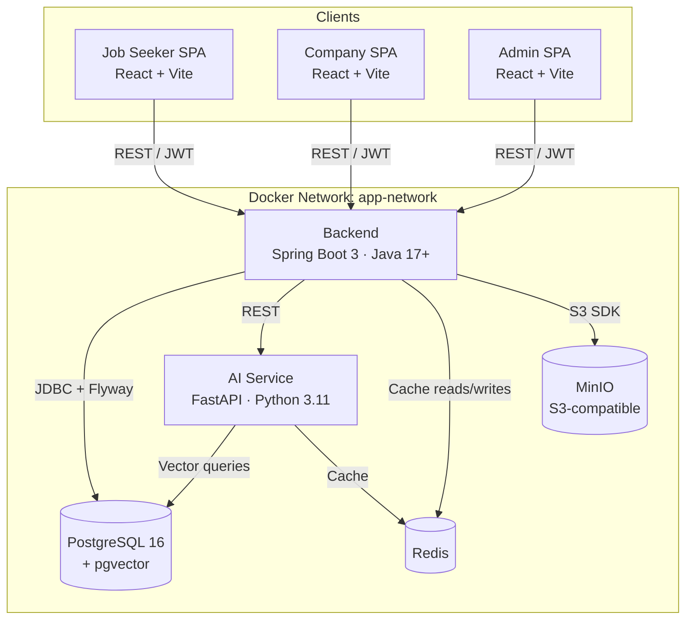
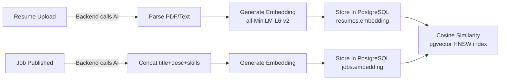

# RecruitPro — Comprehensive Implementation Plan

> **Project**: AI-powered Job Recruitment Platform  
> **Source design**: [DB.dbml](file:///c:/Users/ASUS/Documents/Study/Do%20An/Design%20DB/Design/DB.dbml) · [api-specification.md](file:///c:/Users/ASUS/Documents/Study/Do%20An/Design%20DB/Design/api-specification.md) · [Rule files](file:///c:/Users/ASUS/Documents/Study/Do%20An/Design%20DB/.agents/rules)

---

## 1 · Architecture Overview



### Component Interaction Summary

| From → To | Protocol | Purpose |
|---|---|---|
| Frontend → Backend | HTTPS + JWT Bearer | All API operations |
| Backend → PostgreSQL | JDBC (HikariCP) | Business data storage |
| Backend → Redis | Lettuce | Session-less caching, rate-limiting, refresh token store |
| Backend → MinIO | AWS S3 SDK | Resume/avatar/logo file storage |
| Backend → AI Service | REST (WebClient) | Embedding generation, recommendations, scoring |
| AI Service → PostgreSQL | psycopg2/asyncpg | Read-only vector similarity queries |
| AI Service → Redis | redis-py | Recommendation cache |

---

## 2 · Service Breakdown

### 2.1 Backend — Java Spring Boot 3

| Attribute | Value |
|---|---|
| **Tech** | Java 17+, Spring Boot 3, Spring Security 6, Spring Data JPA, Flyway, HikariCP, MapStruct, Lombok |
| **Responsibilities** | Auth (JWT), RBAC, CRUD for all entities, AI Service delegation, file storage orchestration, audit logging |

**Package structure** (per rule: [backend.md](file:///c:/Users/ASUS/Documents/Study/Do%20An/Design%20DB/.agents/rules/backend.md)):

```
backend/
├── src/main/java/com/recruitpro/
│   ├── config/         # SecurityConfig, RedisConfig, MinioConfig, DataSeeder
│   ├── controller/     # REST controllers (@RestController)
│   ├── service/        # Business logic (@Service)
│   ├── repository/     # Spring Data JPA repos
│   ├── model/          # JPA entities
│   ├── dto/
│   │   ├── request/    # *RequestDto with Bean Validation
│   │   └── response/   # *ResponseDto
│   ├── mapper/         # MapStruct mappers
│   ├── security/       # JwtAuthenticationFilter, JwtUtil
│   ├── client/         # AiServiceClient
│   ├── storage/        # StorageService (MinIO S3)
│   ├── cache/          # CacheService (Redis)
│   ├── exception/      # Domain exceptions + GlobalExceptionHandler
│   └── util/           # Helpers
├── src/main/resources/
│   ├── application.yml
│   ├── application-dev.yml
│   ├── db/migration/   # Flyway V*.sql
│   └── db/seed/        # Optional seed SQL
├── src/test/java/com/recruitpro/
│   ├── AbstractDatabaseTest.java
│   ├── TestDataFactory.java
│   └── ...             # Unit + integration tests
├── Dockerfile
├── Dockerfile.dev
└── pom.xml
```

---

### 2.2 Frontend — React (×3 apps)

| Attribute | Value |
|---|---|
| **Tech** | React 18, Vite, React Router 6, React Query, Axios, React Hook Form, Zustand |
| **Apps** | `frontend-jobseeker/` · `frontend-company/` · `frontend-admin/` |

**Per-app structure** (per rule: [frontend.md](file:///c:/Users/ASUS/Documents/Study/Do%20An/Design%20DB/.agents/rules/frontend.md)):

```
frontend-{role}/
├── public/
├── src/
│   ├── components/     # Reusable UI (Button, Modal, DataTable, etc.)
│   ├── pages/          # Route-level pages
│   ├── hooks/          # Custom hooks (useAuth, useDebounce, etc.)
│   ├── services/       # API call functions (axiosInstance, authService, etc.)
│   ├── store/          # Zustand store (auth, notifications)
│   ├── utils/          # Pure helpers
│   ├── types/          # TS interfaces
│   ├── constants/      # Text strings, route paths, enum maps
│   ├── routes/         # Central route config + PrivateRoute
│   └── App.tsx
├── Dockerfile
├── Dockerfile.dev
├── vite.config.ts
└── package.json
```

**Page inventory** derived from design HTML files:

| App | Pages (from Design/) |
|---|---|
| **Admin** | Login, Dashboard, Users, User Detail, Companies, Company Detail, Jobs, Applications, Subscriptions, Payments, Skills, Audit Logs, Notifications, Settings |
| **Company** | Login, Signup, Forgot Password, Dashboard, Company Profile, Jobs, Job Create, Job Detail, Applications, Application Detail, Interviews, Interview Schedule, Staff, Messages, Notifications, Subscriptions |
| **JobSeeker** | Login, Signup, Forgot Password, Dashboard, Profile, Jobs, Job Detail, Applications, Application Detail, Interviews, Resumes, Messages, Notifications |

---

### 2.3 AI Service — Python FastAPI

| Attribute | Value |
|---|---|
| **Tech** | Python 3.11, FastAPI, Uvicorn, sentence-transformers (all-MiniLM-L6-v2), psycopg2 / asyncpg, redis-py, Pydantic v2, pytest |
| **Responsibilities** | Embedding generation (jobs + resumes), job recommendation, candidate scoring/matching |

**Structure** (per rule: [ai-service.md](file:///c:/Users/ASUS/Documents/Study/Do%20An/Design%20DB/.agents/rules/ai-service.md)):

```
ai-service/
├── app/
│   ├── api/            # Route handlers
│   │   ├── health.py
│   │   ├── embeddings.py
│   │   ├── recommendations.py
│   │   └── scoring.py
│   ├── core/           # Config, lifespan, settings
│   ├── models/         # Pydantic schemas
│   ├── services/       # Logic + orchestration
│   ├── ml/             # Model loading, inference, feature eng.
│   ├── utils/
│   └── main.py
├── tests/
├── requirements.txt
├── Dockerfile
└── Dockerfile.dev
```

---

### 2.4 Infrastructure

```
project-root/
├── docker-compose.yml          # Base orchestration (6 services)
├── docker-compose.dev.yml      # Dev overrides (hot reload, volume mounts)
├── docker-compose.prod.yml     # Production profile
├── .env.example                # All env var keys
├── .gitignore
├── Makefile                    # build, up, down, logs, restart
├── README.md
├── backend/
├── frontend-jobseeker/
├── frontend-company/
├── frontend-admin/
└── ai-service/
```

---

## 3 · Database Plan

### 3.1 Entities & Relationships

Derived from [DB.dbml](file:///c:/Users/ASUS/Documents/Study/Do%20An/Design%20DB/Design/DB.dbml):

| Table | PK | FK relationships | Delete strategy |
|---|---|---|---|
| `users` | UUID | — | Soft (deleted_at) |
| `companies` | UUID | — | Soft |
| `company_addresses` | UUID | → `companies` | Hard |
| `staff` | UUID | → `users`, → `companies` | Hard |
| `job_seekers` | UUID | → `users` | Soft (via users) |
| `jobs` | UUID | → `companies`, → `company_addresses` | Soft |
| `skills` | UUID | — | Hard |
| `job_skills` | UUID | → `jobs`, → `skills` | Hard |
| `resumes` | UUID | → `job_seekers` | Soft |
| `applications` | UUID | → `jobs`, → `job_seekers`, → `resumes` | Soft |
| `interviews` | UUID | → `applications`, → `staff` | Hard |
| `conversations` | UUID | → `jobs`, → `staff`, → `job_seekers` | Hard |
| `messages` | UUID | → `conversations`, → `users` | Hard |
| `notifications` | UUID | → `users` | Hard |
| `plans` | UUID | — | Hard |
| `subscriptions` | UUID | → `companies`, → `plans` | Hard |
| `payments` | UUID | → `companies`, → `subscriptions` | Hard |
| `audit_logs` | UUID | → `users` | Hard |
| `otps` | UUID | — | Hard |
| `job_views` | UUID | → `job_seekers`, → `jobs` | Hard |
| `saved_jobs` | UUID | → `job_seekers`, → `jobs` | Hard |

### 3.2 Indexing Strategy

| Index | Table | Column(s) | Type | Justification |
|---|---|---|---|---|
| `uq_users_email` | users | email | Unique partial (`WHERE deleted_at IS NULL`) | Login lookup |
| `idx_staff_company_id` | staff | company_id | B-tree | Staff list per company |
| `idx_staff_user_id` | staff | user_id | Unique | Reverse lookup |
| `idx_jobs_company_id` | jobs | company_id | B-tree | Company's job list |
| `idx_jobs_status` | jobs | status | Partial (`WHERE deleted_at IS NULL`) | Published job filter |
| `idx_jobs_embedding` | jobs | embedding | HNSW (cosine) | Vector similarity search |
| `idx_resumes_embedding` | resumes | embedding | HNSW (cosine) | Candidate matching |
| `idx_resumes_job_seeker_id` | resumes | job_seeker_id | B-tree | Seeker's resumes |
| `uq_applications_job_seeker` | applications | (job_id, job_seeker_id) | Unique | Prevent duplicate apps |
| `idx_applications_job_id_status` | applications | (job_id, status) | Composite | Company app filter |
| `idx_interviews_application_id` | interviews | application_id | B-tree | App→interview lookup |
| `idx_notifications_user_id` | notifications | user_id | B-tree | User notifications |
| `idx_job_views_seeker_job` | job_views | (job_seeker_id, job_id) | Composite | View history dedup |
| `uq_saved_jobs_seeker_job` | saved_jobs | (job_seeker_id, job_id) | Unique | Prevent duplicate saves |
| `idx_audit_logs_user_id` | audit_logs | user_id | B-tree | User activity lookup |

### 3.3 Flyway Migration Sequence

```
V1__create_extensions.sql              -- pgvector, uuid-ossp
V2__create_enum_types.sql              -- All 13 enum types
V3__create_users_table.sql
V4__create_companies_table.sql
V5__create_company_addresses_table.sql
V6__create_staff_table.sql
V7__create_job_seekers_table.sql
V8__create_skills_table.sql
V9__create_jobs_table.sql
V10__create_job_skills_table.sql
V11__create_resumes_table.sql
V12__create_applications_table.sql
V13__create_interviews_table.sql
V14__create_conversations_messages.sql
V15__create_notifications_table.sql
V16__create_plans_subscriptions.sql
V17__create_payments_table.sql
V18__create_audit_logs_table.sql
V19__create_otps_table.sql
V20__create_job_views_saved_jobs.sql
V21__create_indexes.sql
```

### 3.4 Optimization Strategies

- **Partial indexes** on soft-deleted tables (`WHERE deleted_at IS NULL`) to keep index scans tight
- **HNSW** for pgvector (faster recall at scale vs IVFFlat)
- **Connection pool tuning**: HikariCP `maximum-pool-size` = 20 dev / 50 prod
- **Read replicas**: prepared for future horizontal scaling
- **Batch inserts** for job_views (bulk behavioral data)

---

## 4 · API Plan

### 4.1 Module Breakdown

All endpoints prefixed with `/api/v1/`. Full spec from [api-specification.md](file:///c:/Users/ASUS/Documents/Study/Do%20An/Design%20DB/Design/api-specification.md).

| # | Module | Endpoints | Auth scope |
|---|---|---|---|
| 1 | **Auth** | 9 endpoints | Mostly public; `logout`, `change-password` = Bearer |
| 2 | **Users (Admin)** | 3 endpoints | ADMIN |
| 3 | **Companies** | 5 endpoints | Mixed (public + COMPANY + ADMIN) |
| 4 | **Company Addresses** | 4 endpoints | COMPANY |
| 5 | **Staff** | 4 endpoints | COMPANY (OWNER) |
| 6 | **Job Seekers** | 3 endpoints | JOBSEEKER |
| 7 | **Skills** | 4 endpoints | Public read + ADMIN write |
| 8 | **Jobs** | 7 endpoints | Public read + COMPANY write |
| 9 | **Resumes** | 5 endpoints | JOBSEEKER (+ COMPANY read) |
| 10 | **Applications** | 6 endpoints | JOBSEEKER apply + COMPANY manage |
| 11 | **Interviews** | 6 endpoints | COMPANY manage + JOBSEEKER view |
| 12 | **Conversations & Messages** | 4 endpoints | Bearer (both roles) |
| 13 | **Notifications** | 4 endpoints | Bearer |
| 14 | **Plans & Subscriptions** | 6 endpoints | Public read + ADMIN manage + COMPANY subscribe |
| 15 | **Payments** | 2 endpoints | COMPANY + public webhook |
| 16 | **Saved Jobs** | 3 endpoints | JOBSEEKER |
| 17 | **Audit Logs** | 1 endpoint | ADMIN |

### 4.2 Data Flow Diagrams

**Job Application Flow**:
```
JobSeeker FE → POST /applications → Backend
    Backend → validate job exists, seeker has resume
    Backend → create application (status=APPLIED)
    Backend → call AI Service /api/v1/score (resume embedding vs job embedding)
    AI Service → cosine similarity → return ai_score
    Backend → update application.ai_score
    Backend → create notification for company staff
    Backend → return application + score
```

**Recommendation Flow**:
```
JobSeeker FE → GET /recommendations → Backend
    Backend → fetch seeker profile + resume embedding
    Backend → call AI Service /api/v1/recommend
    AI Service → check Redis cache
    AI Service → if miss: vector similarity search in PostgreSQL
    AI Service → cache result → return ranked job IDs
    Backend → fetch job details → return to FE
```

---

## 5 · Feature Breakdown by Role

### 5.1 Job Seeker Features

#### 5.1.1 Job Search & Discovery

| Layer | Tasks |
|---|---|
| **Backend** | `GET /jobs` — paginated, filterable by keyword, jobType, experienceLevel, location; `GET /jobs/{id}` detail |
| **Frontend** | Jobs page with search bar, filter sidebar, job cards grid; Job Detail page with apply button |
| **API deps** | `GET /jobs`, `GET /jobs/{id}`, `GET /skills` (filter autocomplete) |
| **AI** | Future: personalized search ranking using seeker embedding |

#### 5.1.2 Recommendation System

| Layer | Tasks |
|---|---|
| **Backend** | New endpoint `GET /recommendations` → delegates to AI Service; returns enriched job list |
| **Frontend** | Dashboard recommendation carousel/section |
| **API deps** | `GET /recommendations` (future), `GET /jobseeker/profile` |
| **AI** | Core feature — cosine similarity between resume embedding and job embeddings; cached in Redis |

#### 5.1.3 Apply to Job

| Layer | Tasks |
|---|---|
| **Backend** | `POST /applications` — validate unique (job_id, job_seeker_id), attach resume, trigger AI scoring |
| **Frontend** | Apply modal with resume selector; Applications list page; Application Detail page |
| **API deps** | `POST /applications`, `GET /jobseeker/applications`, `GET /applications/{id}`, `GET /resumes` |
| **AI** | Auto-scoring on application submission |

#### 5.1.4 Profile & Resume Management

| Layer | Tasks |
|---|---|
| **Backend** | CRUD for profile (`job_seekers`); resume upload → MinIO + parse text + generate embedding via AI |
| **Frontend** | Profile page (edit bio, location, experience, avatar); Resumes page (upload, list, delete) |
| **API deps** | `GET/PUT /jobseeker/profile`, `POST /jobseeker/avatar`, `GET/POST/DELETE /resumes` |
| **AI** | Resume text parsing → embedding generation on upload |

#### 5.1.5 Saved Jobs & Job Views

| Layer | Tasks |
|---|---|
| **Backend** | `POST/DELETE /jobs/{id}/save`, `GET /jobseeker/saved-jobs`; job_views tracking (on GET `/jobs/{id}`) |
| **Frontend** | Save/unsave toggle on job cards; Saved jobs page |
| **API deps** | Save/unsave APIs |
| **AI** | Job views data feeds into recommendation model (behavioral signal) |

---

### 5.2 Company Features

#### 5.2.1 Post & Manage Jobs

| Layer | Tasks |
|---|---|
| **Backend** | Full job CRUD; subscription-based post limit check; skill attachment; embedding generation on publish |
| **Frontend** | Job list (own), Create Job form, Job Detail/Edit, Status toggle (Draft/Published/Closed) |
| **API deps** | `GET /company/jobs`, `POST/PUT/PATCH/DELETE /jobs`, `GET /skills` |
| **AI** | Generate job embedding on publish/update via AI Service |

#### 5.2.2 Manage Candidates & Applications

| Layer | Tasks |
|---|---|
| **Backend** | `GET /company/applications` with filters; status workflow (APPLIED → SCREENING → INTERVIEW → OFFER/REJECTED/HIRED) |
| **Frontend** | Applications list with status pipeline view; Application Detail with AI score badge; status update actions |
| **API deps** | Application APIs + interview scheduling |
| **AI** | Display AI matching score; future: batch re-score on model update |

#### 5.2.3 Interview Scheduling

| Layer | Tasks |
|---|---|
| **Backend** | Interview CRUD; link to application + staff member; calendar view data |
| **Frontend** | Interview calendar (month/week/day views), schedule modal, status updates |
| **API deps** | Interview APIs |
| **AI** | None |

#### 5.2.4 Dashboard

| Layer | Tasks |
|---|---|
| **Backend** | Aggregation endpoints (job count, app count by status, recent activity) |
| **Frontend** | Stats cards, charts, recent applications list |
| **API deps** | Aggregated dashboard endpoint (to be added) |
| **AI** | None |

#### 5.2.5 Staff & Company Profile

| Layer | Tasks |
|---|---|
| **Backend** | Staff CRUD (OWNER only); company profile update + logo upload |
| **Frontend** | Staff management page; Company Profile editor |
| **API deps** | Staff APIs, Company APIs |
| **AI** | None |

#### 5.2.6 Subscription & Payments

| Layer | Tasks |
|---|---|
| **Backend** | Plan listing; subscription creation; payment gateway integration (VNPay/MoMo/Stripe); webhook processing |
| **Frontend** | Plan selector; subscription status; payment history |
| **API deps** | Plan + subscription + payment APIs |
| **AI** | None |

---

### 5.3 Admin Features

#### 5.3.1 User Management

| Layer | Tasks |
|---|---|
| **Backend** | `GET /admin/users` with pagination + role/status filter; `PATCH /admin/users/{id}/status` (suspend/activate) |
| **Frontend** | User list table, User Detail modal, status toggle |
| **API deps** | Admin user APIs |

#### 5.3.2 Company Verification & Management

| Layer | Tasks |
|---|---|
| **Backend** | `PATCH /admin/companies/{id}/verify`; company list + detail |
| **Frontend** | Companies table, Company Detail page with verify action |
| **API deps** | Admin company APIs |

#### 5.3.3 Content Moderation (Jobs, Applications)

| Layer | Tasks |
|---|---|
| **Backend** | Admin-level access to all jobs + applications (per RBAC) |
| **Frontend** | Jobs table (all companies); Applications table (all) |
| **API deps** | Same as existing with ADMIN auth |

#### 5.3.4 Master Data (Skills, Plans)

| Layer | Tasks |
|---|---|
| **Backend** | Full CRUD for skills and plans |
| **Frontend** | Skills management page; Plans management page |
| **API deps** | Skills APIs, Plans APIs |

#### 5.3.5 System Monitoring (Audit Logs, Notifications, Settings)

| Layer | Tasks |
|---|---|
| **Backend** | `GET /admin/audit-logs` with pagination + filters |
| **Frontend** | Audit logs table; Notifications; Settings |
| **API deps** | Audit log API |

---

## 6 · AI Service Plan

### 6.1 Data Pipeline



### 6.2 API Endpoints

| Endpoint | Input | Output | Purpose |
|---|---|---|---|
| `POST /api/v1/embeddings/generate` | `{ text: string }` | `{ embedding: float[] }` | Generate vector from text |
| `POST /api/v1/recommend/jobs` | `{ candidateId, resumeEmbedding, limit }` | `{ jobs: [{jobId, score}] }` | Job recommendations for seeker |
| `POST /api/v1/score/application` | `{ resumeEmbedding, jobEmbedding }` | `{ score: float }` | Score candidate–job match |
| `GET /api/v1/health` | — | `{ status, modelVersion, modelsLoaded }` | Health check |

### 6.3 Improvement Phases

| Phase | Description |
|---|---|
| **v1** | Cosine similarity with sentence-transformers (all-MiniLM-L6-v2, 384 dims). Simple vector matching. |
| **v2** | Add behavioral signals (job_views.duration_seconds, saved_jobs, application history) as feature weights on top of embedding similarity. Hybrid scoring. |
| **v3** | Fine-tune model on domain-specific job–resume pairs. Add skill-graph matching. Implement A/B testing framework for model comparison. |

---

## 7 · Development Phases

### Phase 1: Foundation (Weeks 1–2)

**Goal**: Runnable infrastructure with empty services.

- [ ] Initialize repo, `.gitignore`, `README.md`
- [ ] Create `docker-compose.yml` with all 6 services (backend, frontend, ai-service, db, redis, minio)
- [ ] Create `docker-compose.dev.yml` with hot reload config
- [ ] Create `.env.example` with all required vars
- [ ] Create `Makefile` (build, up, down, logs, restart)
- [ ] **Backend**: Spring Boot skeleton with package structure, `Dockerfile` + `Dockerfile.dev`, health endpoint
- [ ] **Frontend ×3**: Vite + React + TypeScript scaffolds with routing skeleton, `Dockerfile` + `Dockerfile.dev`
- [ ] **AI Service**: FastAPI skeleton with `/health` endpoint, `Dockerfile` + `Dockerfile.dev`
- [ ] **Database**: Flyway migrations V1–V21 (all tables, indexes, extensions)
- [ ] **DataSeeder**: Seed `skills` and `plans` tables

---

### Phase 2: Core Features (Weeks 3–6)

**Goal**: Working auth + basic CRUD for all main entities.

- [ ] **Auth module**: Registration, Login (JWT), Refresh, Logout, OTP verification, Forgot/Reset password
- [ ] **Spring Security config**: JwtAuthenticationFilter, SecurityFilterChain, CORS, RBAC
- [ ] **Frontend auth**: Login/Signup/Forgot Password pages for all 3 apps; Axios interceptors; token storage (Zustand)
- [ ] **User management (Admin)**: List users, user detail, suspend/activate
- [ ] **Company module**: Profile CRUD, logo upload (MinIO), address management, staff management
- [ ] **Job Seeker module**: Profile CRUD, avatar upload (MinIO)
- [ ] **Skills module**: CRUD (Admin); read-only for others
- [ ] **Jobs module**: Full CRUD for Company; public listing + detail for JobSeeker
- [ ] **Resume module**: Upload (MinIO), list, delete, download (pre-signed URL)
- [ ] **StorageService** (MinIO integration): upload, download, pre-signed URL generation
- [ ] **CacheService** (Redis): basic cache operations with TTL + key namespacing
- [ ] **GlobalExceptionHandler**: Unified error response envelope

---

### Phase 3: Advanced Features (Weeks 7–10)

**Goal**: Full application workflow + AI integration.

- [ ] **Applications module**: Apply, list (seeker + company), status workflow, withdraw
- [ ] **AI Service v1**: Model loading (all-MiniLM-L6-v2), embedding generation endpoint
- [ ] **AiServiceClient** (Backend): WebClient calls to AI Service with timeout + fallback
- [ ] **Embedding pipeline**: Auto-generate embedding on job publish + resume upload
- [ ] **AI scoring**: Score application on submit (resume vs job embedding)
- [ ] **Recommendation endpoint**: Job recommendations for job seekers
- [ ] **Interview module**: Schedule, list (calendar data), update, status changes
- [ ] **Conversations & Messages**: Start conversation, send/receive messages
- [ ] **Notifications**: Create on events (application, interview, message); list + mark read
- [ ] **Saved Jobs + Job Views**: Save/unsave; track view duration
- [ ] **Subscription & Payments**: Plan selection, subscription create, payment gateway webhook (VNPay/MoMo/Stripe), job post limit enforcement
- [ ] **Audit Logs**: Auto-log create/update/delete/login/logout actions

---

### Phase 4: Optimization (Weeks 11–12)

**Goal**: Performance tuning and stability.

- [ ] **Redis caching**: Cache job listings, recommendations, skill lists; define invalidation strategies
- [ ] **Query optimization**: Analyze slow queries, verify all indexes are hit, tune composite indexes
- [ ] **HikariCP tuning**: Pool sizing based on load tests
- [ ] **API pagination**: Enforce max page size (100); tune default page sizes
- [ ] **Frontend performance**: React.lazy + Suspense for route splitting; React Query stale-while-revalidate config
- [ ] **AI Service optimization**: `run_in_executor` for CPU-bound inference; Redis cache for recommendations
- [ ] **Rate limiting**: OTP send (1/60s per email), login attempts
- [ ] **File validation**: Size limits + type checks on upload endpoints

---

### Phase 5: Production Ready (Weeks 13–14)

**Goal**: Secure, monitored, deployable system.

- [ ] **Testing**: Unit tests for all services; integration tests with Testcontainers (pgvector); frontend component tests
- [ ] **Security hardening**: Input sanitization, SQL injection prevention (parameterized queries), XSS mitigation, HTTPS enforcement
- [ ] **docker-compose.prod.yml**: Multi-stage builds, non-root containers, no exposed DB/Redis ports, env-based config
- [ ] **Monitoring**: Health endpoints for all services, structured logging with correlationId, error alerting
- [ ] **Documentation**: API docs (Swagger/OpenAPI), README with setup instructions, architecture diagrams
- [ ] **CI/CD**: Dockerfile build tests, Flyway migration validation, unit test pipeline

---

## 8 · Task Breakdown (Actionable)

### Phase 1 Tasks

| # | Task | Subtasks | Depends on |
|---|---|---|---|
| 1.1 | Initialize repository | Create root dir, `.gitignore`, `README.md`, `LICENSE` | — |
| 1.2 | Docker Compose base | `docker-compose.yml` (6 services, network, volumes, healthchecks) | 1.1 |
| 1.3 | Docker Compose dev | `docker-compose.dev.yml` (hot reload mounts + commands) | 1.2 |
| 1.4 | Environment config | `.env.example` with all vars; `.env` for local dev | 1.2 |
| 1.5 | Makefile | build, up, down, logs, restart targets | 1.2 |
| 1.6 | Backend skeleton | Spring Boot init (Maven), package structure, `application.yml`, health endpoint | 1.1 |
| 1.7 | Backend Dockerfiles | `Dockerfile` (multi-stage prod), `Dockerfile.dev` (Maven SDK + watcher) | 1.6 |
| 1.8 | Frontend — JobSeeker | Vite + React + TS init, routing skeleton, dev Dockerfile | 1.1 |
| 1.9 | Frontend — Company | Same as 1.8 | 1.1 |
| 1.10 | Frontend — Admin | Same as 1.8 | 1.1 |
| 1.11 | AI Service skeleton | FastAPI project structure, `/health`, dev Dockerfile | 1.1 |
| 1.12 | DB Migrations | V1–V21 Flyway SQL files covering all tables + indexes | 1.6 |
| 1.13 | DataSeeder | `DataSeeder.java` for skills + plans | 1.12 |
| 1.14 | Smoke test | `docker compose -f docker-compose.yml -f docker-compose.dev.yml up` → verify all services start | 1.2–1.13 |

### Phase 2 Tasks

| # | Task | Subtasks | Depends on |
|---|---|---|---|
| 2.1 | JWT Auth infrastructure | JwtUtil, JwtAuthenticationFilter, SecurityFilterChain, CORS config | 1.6 |
| 2.2 | Auth endpoints | Register, Login, Refresh, Logout, VerifyOTP, ResendOTP, ForgotPassword, ResetPassword, ChangePassword | 2.1 |
| 2.3 | Auth — Email service | Email abstraction for OTP delivery | 2.2 |
| 2.4 | Frontend auth flows | Login + Signup + ForgotPassword pages (×3 apps), Axios interceptors, Zustand auth store, PrivateRoute | 2.2 |
| 2.5 | GlobalExceptionHandler | `@ControllerAdvice` mapping domain exceptions → API envelope | 1.6 |
| 2.6 | ApiResponse envelope | `ApiResponse<T>` wrapper class | 2.5 |
| 2.7 | Admin — User mgmt | Controller + Service + Repo for user list, detail, status patch | 2.1 |
| 2.8 | Company module | Profile, Logo upload (StorageService), Addresses, Staff CRUD | 2.1 |
| 2.9 | StorageService | MinIO S3 client wrapper: upload, download, pre-signed URL | 1.6 |
| 2.10 | Job Seeker module | Profile, Avatar upload | 2.1, 2.9 |
| 2.11 | Skills module | CRUD (Admin write, public read) | 2.1 |
| 2.12 | Jobs module | Full CRUD (Company), public listing (JobSeeker), skill attachment | 2.8, 2.11 |
| 2.13 | Resume module | Upload to MinIO, list, detail, download URL, soft delete | 2.9, 2.10 |
| 2.14 | CacheService | Redis abstraction: get/set/delete with TTL + namespace | 1.6 |
| 2.15 | Frontend — Company pages | Dashboard, Jobs list/create/detail, Company Profile, Staff, Addresses | 2.4, 2.8, 2.12 |
| 2.16 | Frontend — JobSeeker pages | Dashboard, Jobs list/detail, Profile, Resumes | 2.4, 2.10, 2.12, 2.13 |
| 2.17 | Frontend — Admin pages | Dashboard, Users, Companies, Jobs, Skills | 2.4, 2.7, 2.11 |

### Phase 3 Tasks

| # | Task | Subtasks | Depends on |
|---|---|---|---|
| 3.1 | Applications module | Apply, list (seeker/company), detail, status transitions, withdraw | 2.12, 2.13 |
| 3.2 | AI — Model loading | Lifespan event, model registry singleton, version env var | 1.11 |
| 3.3 | AI — Embedding endpoint | `POST /api/v1/embeddings/generate` | 3.2 |
| 3.4 | AiServiceClient | Backend WebClient → AI Service with timeout + fallback | 1.6, 3.3 |
| 3.5 | Embedding pipeline | Auto-call AI on job publish + resume upload; store vector in DB | 3.4, 2.12, 2.13 |
| 3.6 | AI — Scoring endpoint | `POST /api/v1/score/application` | 3.2 |
| 3.7 | Application AI scoring | On `POST /applications` → call AI scoring → save ai_score | 3.1, 3.6 |
| 3.8 | AI — Recommendation endpoint | `POST /api/v1/recommend/jobs` | 3.2, 3.3 |
| 3.9 | Recommendation integration | Backend wrapper endpoint for job seeker recommendations | 3.8 |
| 3.10 | Interview module | Schedule, list (calendar), update, status | 3.1 |
| 3.11 | Conversations & Messages | Conversation CRUD, message CRUD | 2.1 |
| 3.12 | Notifications | Event-driven creation; list, mark read, unread count | 2.1 |
| 3.13 | Saved Jobs | Save/unsave, list saved | 2.12 |
| 3.14 | Job Views | Track on job detail view; store duration | 2.12 |
| 3.15 | Subscriptions | Plan selection, subscription CRUD, job post limit check | 2.12 |
| 3.16 | Payments | Gateway integration (VNPay), webhook callback, payment history | 3.15 |
| 3.17 | Audit Logs | AOP or interceptor-based logging for CRUD + auth events | 2.1 |
| 3.18 | Frontend — Phase 3 pages | Applications, Interviews (calendar), Messages, Notifications, Subscriptions, AI recommendations | 3.1–3.16 |

### Phase 4 Tasks

| # | Task | Subtasks | Depends on |
|---|---|---|---|
| 4.1 | Redis caching strategy | Cache job listings (5 min), recommendations (15 min), skills (1 hr) | 2.14 |
| 4.2 | Cache invalidation | Invalidate on job CRUD, skill CRUD, model version change | 4.1 |
| 4.3 | Query profiling | EXPLAIN ANALYZE on critical queries; verify index usage | Phase 3 |
| 4.4 | HikariCP tuning | Profile-specific pool sizes | Phase 3 |
| 4.5 | Frontend code splitting | React.lazy for all route pages | Phase 3 |
| 4.6 | AI inference optimization | run_in_executor, batch processing, Redis recommend cache | 3.8 |
| 4.7 | Rate limiting | Custom rate limiter for OTP + login via Redis | 2.14, 2.2 |

### Phase 5 Tasks

| # | Task | Subtasks | Depends on |
|---|---|---|---|
| 5.1 | Backend unit tests | JUnit 5 + Mockito for all Service classes | Phase 3 |
| 5.2 | Backend integration tests | Testcontainers (pgvector), AbstractDatabaseTest, TestDataFactory | Phase 3 |
| 5.3 | Migration test | FlywayMigrationTest on fresh container | 1.12 |
| 5.4 | Seeder idempotency test | Run DataSeeder ×2, verify no dupes | 1.13 |
| 5.5 | AI Service tests | pytest unit + httpx integration tests | Phase 3 |
| 5.6 | Frontend tests | React Testing Library for key components | Phase 3 |
| 5.7 | Security audit | Input sanitization review, token handling check, CORS review | Phase 4 |
| 5.8 | Production Compose | `docker-compose.prod.yml` with multi-stage, non-root, no exposed internal ports | Phase 4 |
| 5.9 | Documentation | OpenAPI/Swagger, README, architecture diagrams | Phase 4 |
| 5.10 | CI pipeline | Build → test → lint in CI; Flyway validate; Docker build test | 5.1–5.6 |

---

## 9 · Folder Structure (Complete)

```
recruitpro/
├── docker-compose.yml
├── docker-compose.dev.yml
├── docker-compose.prod.yml
├── .env.example
├── .gitignore
├── Makefile
├── README.md
│
├── backend/
│   ├── Dockerfile
│   ├── Dockerfile.dev
│   ├── entrypoint-dev.sh                    # Maven watcher script
│   ├── .dockerignore
│   ├── pom.xml
│   └── src/
│       ├── main/
│       │   ├── java/com/recruitpro/
│       │   │   ├── RecruitProApplication.java
│       │   │   ├── config/
│       │   │   │   ├── SecurityConfig.java
│       │   │   │   ├── RedisConfig.java
│       │   │   │   ├── MinioConfig.java
│       │   │   │   ├── CorsConfig.java        # Integrated into SecurityConfig
│       │   │   │   └── DataSeeder.java
│       │   │   ├── controller/
│       │   │   │   ├── AuthController.java
│       │   │   │   ├── AdminUserController.java
│       │   │   │   ├── AdminCompanyController.java
│       │   │   │   ├── CompanyController.java
│       │   │   │   ├── CompanyAddressController.java
│       │   │   │   ├── StaffController.java
│       │   │   │   ├── JobSeekerController.java
│       │   │   │   ├── SkillController.java
│       │   │   │   ├── JobController.java
│       │   │   │   ├── ResumeController.java
│       │   │   │   ├── ApplicationController.java
│       │   │   │   ├── InterviewController.java
│       │   │   │   ├── ConversationController.java
│       │   │   │   ├── NotificationController.java
│       │   │   │   ├── PlanController.java
│       │   │   │   ├── SubscriptionController.java
│       │   │   │   ├── PaymentController.java
│       │   │   │   ├── SavedJobController.java
│       │   │   │   └── AuditLogController.java
│       │   │   ├── service/
│       │   │   │   ├── AuthService.java
│       │   │   │   ├── UserService.java
│       │   │   │   ├── CompanyService.java
│       │   │   │   ├── StaffService.java
│       │   │   │   ├── JobSeekerService.java
│       │   │   │   ├── SkillService.java
│       │   │   │   ├── JobService.java
│       │   │   │   ├── ResumeService.java
│       │   │   │   ├── ApplicationService.java
│       │   │   │   ├── InterviewService.java
│       │   │   │   ├── ConversationService.java
│       │   │   │   ├── NotificationService.java
│       │   │   │   ├── PlanService.java
│       │   │   │   ├── SubscriptionService.java
│       │   │   │   ├── PaymentService.java
│       │   │   │   ├── SavedJobService.java
│       │   │   │   ├── AuditLogService.java
│       │   │   │   ├── EmailService.java
│       │   │   │   └── OtpService.java
│       │   │   ├── repository/
│       │   │   │   └── ...Repository.java      # One per entity
│       │   │   ├── model/
│       │   │   │   ├── User.java
│       │   │   │   ├── Company.java
│       │   │   │   ├── Job.java
│       │   │   │   ├── ...                     # One per table
│       │   │   │   └── enums/
│       │   │   │       ├── UserRole.java
│       │   │   │       ├── JobStatus.java
│       │   │   │       └── ...                 # One per enum
│       │   │   ├── dto/
│       │   │   │   ├── request/
│       │   │   │   │   ├── LoginRequestDto.java
│       │   │   │   │   ├── RegisterRequestDto.java
│       │   │   │   │   ├── JobRequestDto.java
│       │   │   │   │   └── ...
│       │   │   │   ├── response/
│       │   │   │   │   ├── ApiResponse.java
│       │   │   │   │   ├── AuthResponseDto.java
│       │   │   │   │   ├── JobResponseDto.java
│       │   │   │   │   └── ...
│       │   │   │   └── PaginationMeta.java
│       │   │   ├── mapper/
│       │   │   │   ├── JobMapper.java          # MapStruct
│       │   │   │   └── ...
│       │   │   ├── security/
│       │   │   │   ├── JwtUtil.java
│       │   │   │   └── JwtAuthenticationFilter.java
│       │   │   ├── client/
│       │   │   │   └── AiServiceClient.java
│       │   │   ├── storage/
│       │   │   │   └── StorageService.java
│       │   │   ├── cache/
│       │   │   │   └── CacheService.java
│       │   │   ├── exception/
│       │   │   │   ├── GlobalExceptionHandler.java
│       │   │   │   ├── ResourceNotFoundException.java
│       │   │   │   ├── DuplicateResourceException.java
│       │   │   │   ├── UnauthorizedException.java
│       │   │   │   └── AiServiceException.java
│       │   │   └── util/
│       │   │       └── ...
│       │   └── resources/
│       │       ├── application.yml
│       │       ├── application-dev.yml
│       │       ├── application-prod.yml
│       │       ├── db/
│       │       │   ├── migration/
│       │       │   │   ├── V1__create_extensions.sql
│       │       │   │   └── ...V21
│       │       │   └── seed/
│       │       │       └── seed-data.sql
│       │       └── ...
│       └── test/java/com/recruitpro/
│           ├── AbstractDatabaseTest.java
│           ├── TestDataFactory.java
│           ├── FlywayMigrationTest.java
│           └── ...
│
├── frontend-jobseeker/
│   ├── Dockerfile
│   ├── Dockerfile.dev
│   ├── .dockerignore
│   ├── package.json
│   ├── vite.config.ts
│   ├── tsconfig.json
│   ├── index.html
│   └── src/
│       ├── App.tsx
│       ├── main.tsx
│       ├── index.css
│       ├── components/
│       │   ├── layout/
│       │   │   ├── Sidebar.tsx
│       │   │   ├── Header.tsx
│       │   │   └── MainLayout.tsx
│       │   ├── common/
│       │   │   ├── Button.tsx
│       │   │   ├── Modal.tsx
│       │   │   ├── DataTable.tsx
│       │   │   └── LoadingSpinner.tsx
│       │   └── features/
│       │       ├── JobCard.tsx
│       │       ├── ResumeCard.tsx
│       │       └── ApplicationStatusBadge.tsx
│       ├── pages/
│       │   ├── LoginPage.tsx
│       │   ├── SignupPage.tsx
│       │   ├── ForgotPasswordPage.tsx
│       │   ├── DashboardPage.tsx
│       │   ├── ProfilePage.tsx
│       │   ├── JobsPage.tsx
│       │   ├── JobDetailPage.tsx
│       │   ├── ApplicationsPage.tsx
│       │   ├── ApplicationDetailPage.tsx
│       │   ├── InterviewsPage.tsx
│       │   ├── ResumesPage.tsx
│       │   ├── MessagesPage.tsx
│       │   └── NotificationsPage.tsx
│       ├── hooks/
│       │   ├── useAuth.ts
│       │   ├── useDebounce.ts
│       │   └── usePagination.ts
│       ├── services/
│       │   ├── axiosInstance.ts
│       │   ├── authService.ts
│       │   ├── jobService.ts
│       │   ├── resumeService.ts
│       │   ├── applicationService.ts
│       │   └── notificationService.ts
│       ├── store/
│       │   ├── authStore.ts
│       │   └── notificationStore.ts
│       ├── utils/
│       │   ├── formatDate.ts
│       │   └── validators.ts
│       ├── types/
│       │   ├── auth.ts
│       │   ├── job.ts
│       │   ├── application.ts
│       │   └── common.ts
│       ├── constants/
│       │   ├── routes.ts
│       │   ├── strings.ts
│       │   └── enums.ts
│       └── routes/
│           ├── routeConfig.tsx
│           └── PrivateRoute.tsx
│
├── frontend-company/                          # Same structure as frontend-jobseeker
│   └── src/
│       ├── pages/
│       │   ├── LoginPage.tsx
│       │   ├── SignupPage.tsx
│       │   ├── ForgotPasswordPage.tsx
│       │   ├── DashboardPage.tsx
│       │   ├── CompanyProfilePage.tsx
│       │   ├── JobsPage.tsx
│       │   ├── JobCreatePage.tsx
│       │   ├── JobDetailPage.tsx
│       │   ├── ApplicationsPage.tsx
│       │   ├── ApplicationDetailPage.tsx
│       │   ├── InterviewsPage.tsx
│       │   ├── InterviewSchedulePage.tsx
│       │   ├── StaffPage.tsx
│       │   ├── MessagesPage.tsx
│       │   ├── NotificationsPage.tsx
│       │   └── SubscriptionsPage.tsx
│       └── ...
│
├── frontend-admin/                            # Same structure as frontend-jobseeker
│   └── src/
│       ├── pages/
│       │   ├── LoginPage.tsx
│       │   ├── DashboardPage.tsx
│       │   ├── UsersPage.tsx
│       │   ├── UserDetailPage.tsx
│       │   ├── CompaniesPage.tsx
│       │   ├── CompanyDetailPage.tsx
│       │   ├── JobsPage.tsx
│       │   ├── ApplicationsPage.tsx
│       │   ├── SubscriptionsPage.tsx
│       │   ├── PaymentsPage.tsx
│       │   ├── SkillsPage.tsx
│       │   ├── AuditLogsPage.tsx
│       │   ├── NotificationsPage.tsx
│       │   └── SettingsPage.tsx
│       └── ...
│
└── ai-service/
    ├── Dockerfile
    ├── Dockerfile.dev
    ├── .dockerignore
    ├── requirements.txt
    └── app/
        ├── main.py
        ├── api/
        │   ├── health.py
        │   ├── embeddings.py
        │   ├── recommendations.py
        │   └── scoring.py
        ├── core/
        │   ├── config.py
        │   ├── lifespan.py
        │   └── settings.py
        ├── models/
        │   ├── embedding_models.py
        │   ├── recommendation_models.py
        │   └── scoring_models.py
        ├── services/
        │   ├── embedding_service.py
        │   ├── recommendation_service.py
        │   └── scoring_service.py
        ├── ml/
        │   ├── model_registry.py
        │   ├── inference.py
        │   └── feature_engineering.py
        └── utils/
            └── ...
```

---

## 10 · Best Practices Enforcement Summary

Derived directly from the rule files:

| Area | Key rules enforced |
|---|---|
| **Architecture** | Strict Controller → Service → Repository layering; no cross-layer shortcuts |
| **Naming** | `kebab-case` files, `camelCase` JSON, `PascalCase` classes, `snake_case` DB |
| **API** | Envelope `{ success, data, error, meta }` on **every** response; versioned `/api/v1/` |
| **Auth** | Stateless JWT; HS256/RS256 signing; Access (15 min) + Refresh (7 days) rotation; BCrypt ≥ 10 |
| **RBAC** | `@PreAuthorize` on controllers; company-scoped data access; OWNER > HR > RECRUITER |
| **Frontend** | Functional components only; services layer for API; React Query for server state; Zustand for auth; PrivateRoute |
| **Database** | UUID PKs (app-generated); `created_at`/`updated_at` in UTC; soft delete via `deleted_at`; partial indexes |
| **pgvector** | HNSW index with cosine distance (`<=>`); `vector(384)` type; model version–aware cache keys |
| **Redis** | Dedicated CacheService; TTL on every key; domain-namespaced keys; no PII without encryption |
| **MinIO** | StorageService abstraction; pre-signed URLs; private buckets; path-style access; file validation |
| **AI Service** | Stateless; no direct DB writes; model loaded once at startup; Pydantic schemas; envelope response |
| **Docker** | Pinned base images; non-root in prod; named volumes; single bridge network; `.env` for all config |
| **Hot Reload** | `Dockerfile.dev` per service; bind-mount source; Maven watcher + devtools; Vite polling; Uvicorn `--reload` |
| **Testing** | Testcontainers (pgvector image); TestDataFactory; idempotent seeder tests; React Testing Library |
| **Security** | Input sanitization at boundary; parameterized queries; no raw stack traces; CORS whitelist; HTTPS in prod |
| **Logging** | INFO for normal ops; ERROR with context; correlationId per request; never log passwords/tokens/PII |

---

## Verification Plan

Since this is a **planning document** (no code changes), verification consists of:

### Document review
- The user should verify that all rule files are faithfully reflected in the plan.
- The user should validate that all DB.dbml entities and api-specification endpoints are accounted for.
- The user should confirm the phasing and task dependencies make sense for their team size and timeline.

### Future verification (during execution)
- **Phase 1**: `docker compose up` → all 6 containers healthy.
- **Phase 2**: Login → get JWT → call protected endpoint → 200 OK.
- **Phase 3**: Upload resume → embedding generated → apply → AI score returned.
- **Phase 5**: Full Testcontainers test suite passes; Flyway migration on fresh DB succeeds.
